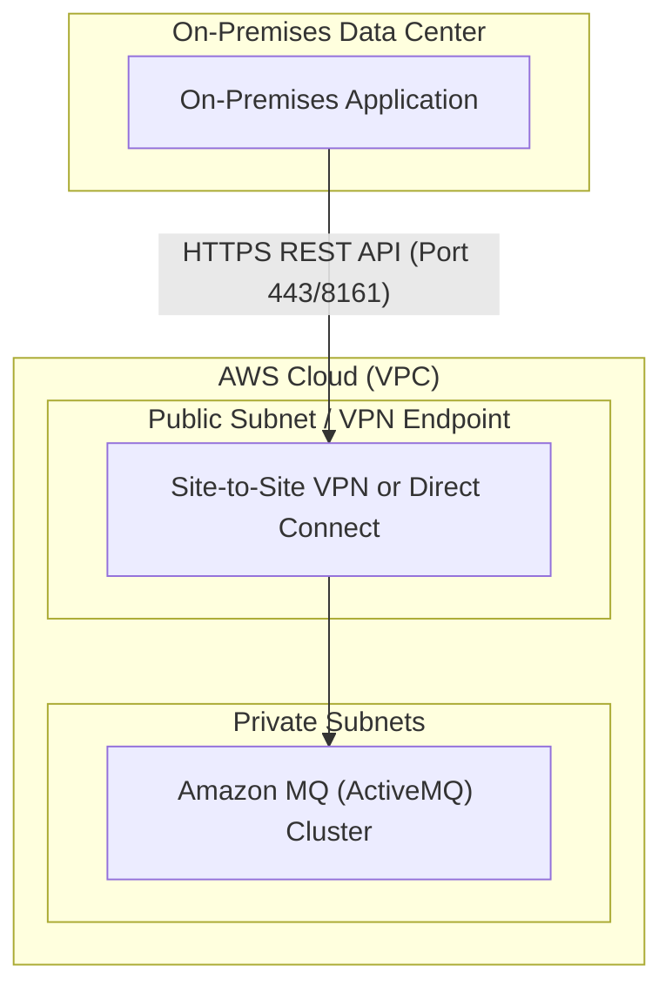
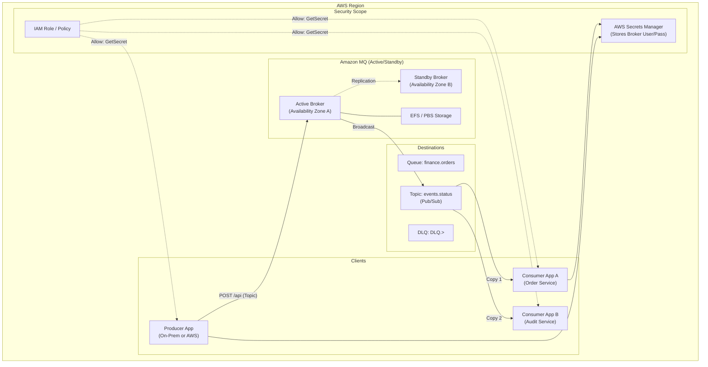

# AWS ActiveMQ Solution Design

## Executive Summary
This document outlines the architecture for deploying an Amazon MQ (ActiveMQ) cluster on AWS and establishing connectivity for an on-premises application to send messages via the ActiveMQ REST API.

## 1. Architecture Overview



## 1.1 Detailed AWS Internal Architecture

This diagram illustrates the interaction between the Consumer application, AWS Secrets Manager, IAM, and the Broker architecture.



## 2. Infrastructure Components

### 2.1 Amazon MQ Broker
*   **Engine**: ActiveMQ Classic (Recommendation: latest supported version, e.g., 5.17 or 5.18).
*   **Deployment Mode**: Active/Standby Multi-AZ (High Availability).
*   **Storage**: Amazon EFS (Durability optimized) or EBS (Throughput optimized) depending on message persistence needs.
*   **Access**:
    *   **Private Broker**: Deployed in private subnets. Not directly accessible from the internet. This is the **recommended** approach for enterprise security.
    *   **Public Broker**: (Alternative) Deployed in public subnets with strict Security Group allow-lists.

### 2.2 Network & Connectivity
To securely consume the API from on-premises, we recommend a private connection:
*   **AWS Site-to-Site VPN** or **Direct Connect**: Establishes a secure tunnel between On-Prem and AWS VPC.
*   **Security Groups**:
    *   Inbound: Allow traffic on port `8161` (Web Console/REST API) and `61616` (OpenWire) *only* from the On-Premises CIDR range.
    *   Outbound: Restrict to necessary traffic.

### 2.3 IAM Roles & Policies

#### A. Broker Execution Role (Operation)
To allow Amazon MQ to publish logs to CloudWatch, we need an IAM Role attached to the broker (if not using the default Service Linked Role).
*   **Role Name**: `mq-broker-role`
*   **Permissions**:
    *   `logs:CreateLogGroup`
    *   `logs:CreateLogStream`
    *   `logs:PutLogEvents`

#### B. Provisioning Permissions (Terraform)
The IAM User/Role executing the Terraform (`terraform apply`) requires the following constrained permissions:

```json
{
    "Version": "2012-10-17",
    "Statement": [
        {
            "Effect": "Allow",
            "Action": [
                "mq:*",
                "ec2:CreateSecurityGroup",
                "ec2:AuthorizeSecurityGroupIngress",
                "ec2:DescribeVpcs",
                "ec2:DescribeSubnets",
                "kms:CreateKey",
                "kms:CreateAlias",
                "ssm:PutParameter",
                "secretsmanager:CreateSecret",
                "secretsmanager:GetSecretValue",
                "iam:CreateRole",
                "iam:PassRole",
                "iam:AttachRolePolicy"
            ],
            "Resource": "*"
        }
    ]
}
```

ActiveMQ provides a REST API allows sending messages via HTTP POST.

#### 3.1 Endpoint Structure
The base URL for a private broker will look like:
`https://<broker-id>.mq.<region>.amazonaws.com:8161/api/message/<queue-name>?type=queue`

#### 3.2 Authentication
*   Amazon MQ uses Basic Authentication (Username/Password).
*   Credentials should be stored securely (e.g., AWS Secrets Manager) and retrieved by the on-prem application or injected via environment variables.

#### 3.3 Sending a Message (Example)
**Method**: `POST`
**URL (Queue)**: `https://.../api/message/my-queue?type=queue`
**URL (Topic)**: `https://.../api/message/my-topic?type=topic`
**Headers**:
*   `Authorization`: Basic <base64-encoded-credentials>
*   `Content-Type`: text/plain (or application/json)
**Body**: The message payload.

## 4. ActiveMQ Configuration & Security

To implement granular access control (ensuring not all queues are accessible by everyone), we use a combination of **Terraform** (for Users/Groups) and **XML Configuration** (for Permissions).

### 4.1 Process: Defining Roles and Permissions

1.  **Define Users & Groups (Terraform)**:
    *   We do *not* define users in XML. We use the `aws_mq_user` Terraform resource.
    *   This resource maps a specific **Username** to a list of **Groups**.
    *   *Example*:
        *   User `finance-app` -> Groups: `["finance-group", "common-producers"]`
        *   User `audit-service` -> Groups: `["audit-group", "common-consumers"]`

2.  **Define Permissions (ActiveMQ XML)**:
    *   We use the `<authorizationPlugin>` in the Broker's Configuration XML.
    *   We map **Destinations** (Queues/Topics) to **Groups** (read/write/admin).

### 4.2 Configuration Snippet (`activemq.xml`)

Here is how we restrict access so `finance-group` can only touch `finance.>` queues.

```xml
<authorizationPlugin>
  <map>
    <authorizationMap>
      <authorizationEntries>
        <!-- Admins have full access to everything -->
        <authorizationEntry queue=">" read="admins" write="admins" admin="admins" />
        <authorizationEntry topic=">" read="admins" write="admins" admin="admins" />

        <!-- Finance Queues: Only Finance Group can Read/Write -->
        <authorizationEntry queue="finance.>" read="finance-group,admins" write="finance-group,admins" admin="admins" />

        <!-- Audit Queues: Audit Group Reads, Finance Group Writes (Example flow) -->
        <authorizationEntry queue="audit.>" read="audit-group,admins" write="finance-group,admins" admin="admins" />
        
        <!-- General Topics: Pub/Sub Logic -->
        <authorizationEntry topic="events.>" read="consumers,admins" write="producers,admins" admin="admins" />

        <!-- ActiveMQ.Advisory: Required for connection metadata -->
        <authorizationEntry topic="ActiveMQ.Advisory.>" read="everyone,admins,finance-group,audit-group" write="everyone,admins,finance-group,audit-group" admin="everyone,admins,finance-group,audit-group" />
      </authorizationEntries>
    </authorizationMap>
  </map>
</authorizationPlugin>
```

### 4.3 Transport Connectors
We ensure the following protocols are enabled:
*   **OpenWire** (`tcp://...:61616`): The native and most efficient protocol.
*   **WSS** (`wss://...:61619`): Secure WebSockets.
*   **AMQP** (`amqp+ssl://...:5671`): Cross-platform messaging protocol.

### 4.3 Dead Letter Queue (DLQ) Strategy
We will configure a DLQ strategy to handle poison messages (messages that cannot be processed after N attempts).

**Strategy**: `IndividualDeadLetterStrategy`
*   Creates a dedicated DLQ for each queue (e.g., `QueueA` -> `DLQ.QueueA`).
*   This is preferred over a shared `ActiveMQ.DLQ` for easier debugging and isolation.

**Configuration Snippet (`activemq.xml`):**
```xml
<destinationPolicy>
  <policyMap>
    <policyEntries>
      <policyEntry queue=">">
        <deadLetterStrategy>
          <individualDeadLetterStrategy queuePrefix="DLQ." useQueueForQueueMessages="true" />
        </deadLetterStrategy>
      </policyEntry>
      <policyEntry topic=">">
        <deadLetterStrategy>
          <individualDeadLetterStrategy topicPrefix="DLQ." useQueueForTopicMessages="true" />
        </deadLetterStrategy>
      </policyEntry>
    </policyEntries>
  </policyMap>
</destinationPolicy>
```

## 5. Message Consumption Pattern

### 5.1 Consumer Overview
While the Producer uses the **REST API** (HTTP), the Consumer should ideally use **OpenWire** (TCP) for reliability, transaction support, and higher throughput.

### 5.2 Consumer Location & Protocol
*   **Location**:
    *   **Option A (Recommended)**: Inside AWS (e.g., EC2, ECS, or Lambda) in a Private Subnet.
    *   **Option B**: On-Premises via VPN/Direct Connect.
*   **Protocol**: OpenWire (`tcp://...:61616`) via the VPN tunnel or private link.

### 5.3 Consumer Logic (C# NMS Client)
The consumer application will:
1.  Connect to the broker using the `OpenWire` endpoint.
2.  Authenticate with `consumer` credentials.
3.  Create a session and consumer for the specific queue.
4.  **Process Messages**:
    *   **Success**: `Acknowledge` the message.
    *   **Failure**: If processing fails, use NACK mechanics.

### 5.4 Understanding ACK and NACK
In messaging, ensuring a message is successfully processed is critical.

*   **ACK (Acknowledgement)**:
    *   **What it means**: "I have successfully processed this message. You can remove it from the queue."
    *   **ActiveMQ Action**: Deletes the message from the queue.
    *   **Code**: `message.Acknowledge();` (in Client Acknowledge mode).

*   **NACK (Negative Acknowledgement) / Rollback**:
    *   **What it means**: "I failed to process this message (e.g., database down, validation error)."
    *   **ActiveMQ Action**:
        1.  The message is **redelivered** to the consumer.
        2.  Redelivery count increments.
        3.  If `RedeliveryCount > MaxRedeliveries` (configured in policy), the message is moved to the **DLQ** (Dead Letter Queue).
    *   **Code**: `session.Recover();` or simply throwing an exception in a transacted session.

## 6. Security Considerations
1.  **Encryption in Transit**: Amazon MQ enforces TLS.
2.  **Encryption at Rest**: Enable encryption using AWS KMS.
3.  **Network Isolation**: Place broker in private subnets; use VPN for access.
4.  **User Management**: Create specific application users in ActiveMQ with limited permissions (e.g., write-only) if possible, separating them from admin users.

### 6.1 Secrets Management: AWS Secrets Manager vs. HashiCorp Vault

We evaluated both options for storing the Broker credentials.

| Feature | AWS Secrets Manager | HashiCorp Vault |
| :--- | :--- | :--- |
| **Integration** | **Native**. Zero-config integration with IAM roles. Best for AWS-hosted consumers. | **Complex**. Requires installing Vault agent or custom authentication logic. |
| **Operational Overhead** | **None**. Fully managed service. | **High** (Self-Hosted) or **Medium** (HCP Managed). Requires maintenance. |
| **Cost** | Pay-per-secret + API calls. Cheaper for small-scale static secrets. | Higher base cost. |
| **Security Depth** | **High**. Uses AWS KMS. Relies on IAM. | **Very High**. Supports dynamic secrets, advanced barriers, and cloud-agnostic policies. |

**Recommendation: AWS Secrets Manager**
For this architecture, **AWS Secrets Manager is the "more secured way"** because:
1.  **Simplicity reduces misconfiguration**: It natively trusts the IAM Roles assigned to your Producer/Consumer.
2.  **No "Secret Zero" problem**: With Vault, you still need a way to authenticate (like an IAM role) to get the secret. Secrets Manager eliminates the middleman.
3.  **Auditability**: All access is logged in CloudTrail linked to the specific IAM Role and IP.


## 8. Implementation Plan (High Level)
1.  **Terraform**: Define VPC, Subnets, Security Groups, `aws_mq_configuration` (XML), and `aws_mq_broker`.
2.  **Configuration**: Define User/Password in SSM Parameter Store or Secrets Manager.
3.  **On-Prem Producer**: Develop C# client using `HttpClient` to hit the REST endpoint.
4.  **Consumer**: Develop C# client using `Apache.NMS` (ActiveMQ) to consume via OpenWire.
5.  **Testing**: Send messages via REST, verify receipt in Consumer, verify DLQ logic by force-failing messages.
